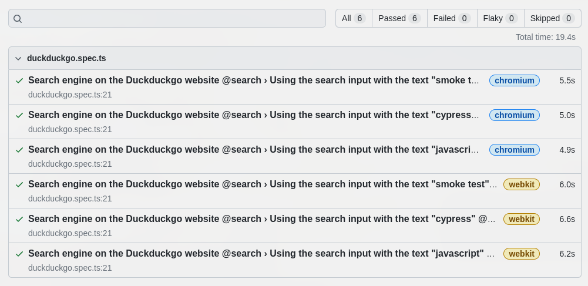

[](https://github.com/prettier/prettier)

# BDD base project: Playwright + Typescript

Basic example of Playwright with Typescript on Chrome and Safari (in parallel)

# Table of contents

* [Get started](#get-started)
  * [Installation](#installation)
* [How to run the tests](#how-to-run-the-tests)
  * [Running tests](#running-tests)
  * [Running tagged tests](#running-tagged-tests)
    * [Running tagged smoke tests](#running-tagged-smoke-tests)
    * [Running using customized tags](#running-using-customized-tags)
  * [Running tests manually](#running-tests-manually)
* [Static code analysis tools](#static-code-analysis-tools)
  * [Set up the Git hooks custom directory](#set-up-the-git-hooks-custom-directory)
  * [How to run the tools](#how-to-run-the-tools)
  * [ESLint](#eslint)
    * [Find Problems](#find-problems)
    * [Fix Automatically](#fix-automatically)
  * [TypeScript Compiler](#typescript-compiler)
    * [Checking code without compilation](#checking-code-without-compilation)
* [License](#license)

# Get started

## Installation

```bash
npm install
```

# How to run the tests

## Running tests

```bash
npm test
```

```bash
Running 6 tests using 2 workers
  Slow test file: [webkit] › duckduckgo.spec.ts (34.2s)
  Slow test file: [chromium] › duckduckgo.spec.ts (34.2s)
  Consider splitting slow test files to speed up parallel execution
  6 passed (34.9s)
```

**HTML report**:



## Running tagged tests

### Running tagged smoke tests

```bash
# defined in package.json file
npm run tag:smoke
```

### Running using customized tags

```bash
npx playwright test --grep @search
```

*more details*: [test annotations](https://playwright.dev/docs/test-annotations#tag-tests)

# Running tests manually

Open **`Playwright`** and run the tests manually:

```bash
npm run playwright:open
```

# Static code analysis tools

These are the linters that will help us to follow good practices and style guides of our source code. We will be using
the following static analysis tools, which will be executed when generating a new push in the repository (git hooks).

## Set up the Git hooks custom directory

After cloning the repository run the following command in the repository root:

```bash
git config core.hooksPath .githooks
```

## How to run the tools

Run ESLint and TypeScript Compiler (without compilation)

```bash
npm run lint
```

## ESLint

### Find Problems

ESLint statically analyzes the code to find problems.

```bash
npm run lint:eslint
```

### Fix Automatically

Many problems ESLint finds can be automatically fixed.

```bash
npm run lint:eslint:fix
```

## TypeScript Compiler

### Checking code without compilation

Check the types and validate the code using TypeScript without compilation.

```bash
npm run lint:tsc
```

# License

[MIT](./LICENSE)
